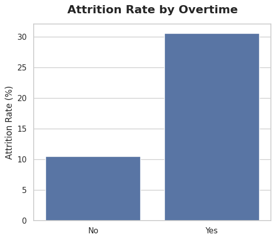
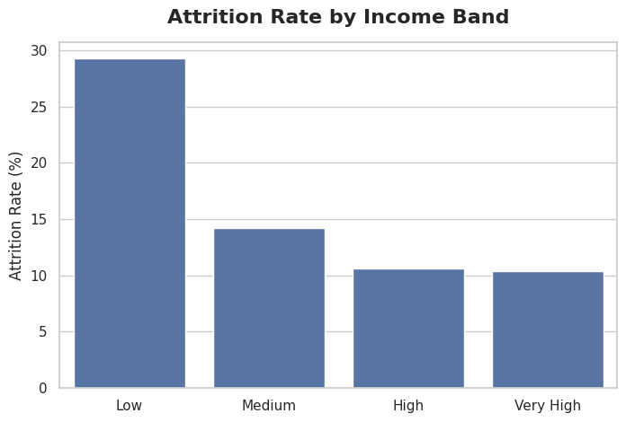
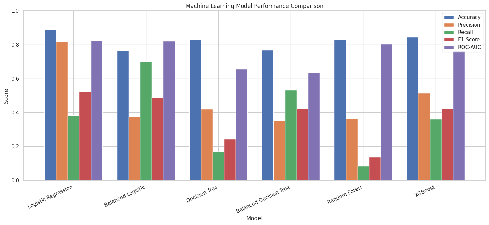
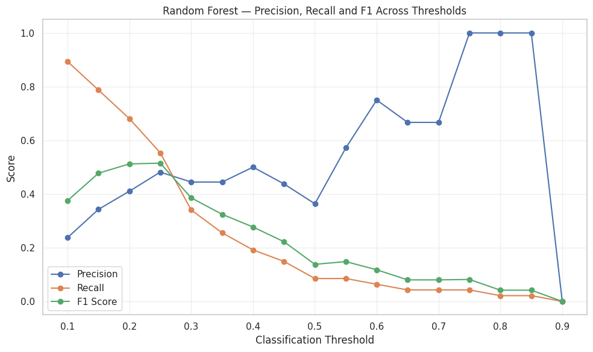
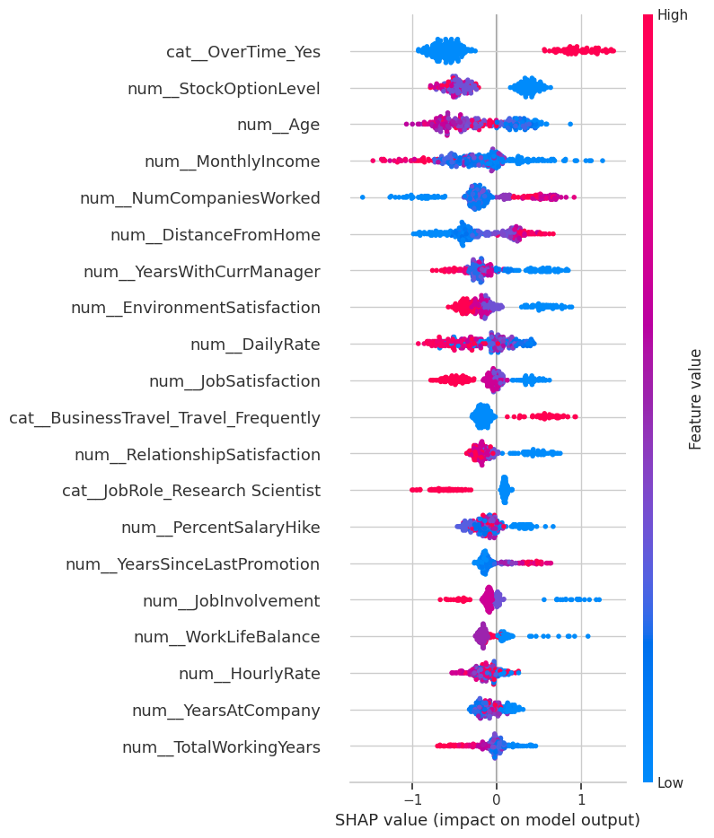
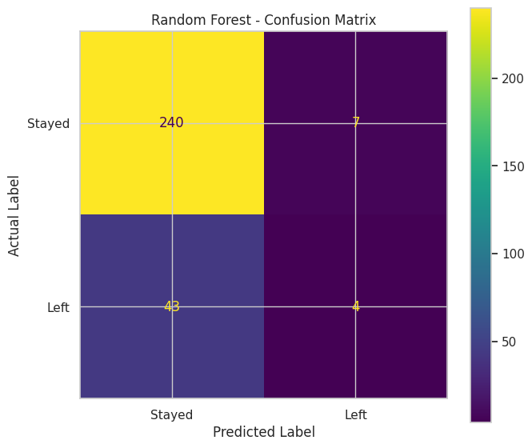

# Employee Attrition Intelligence

## Predicting Employee Turnover and Identifying the Drivers of Attrition

An end-to-end HR analytics and machine learning project focused on understanding employee attrition, identifying the factors associated with turnover, and evaluating predictive approaches that can support proactive employee retention.

The project combines exploratory data analysis, statistical analysis, feature engineering, machine learning, model evaluation, threshold optimization, and model explainability to transform employee-level data into actionable HR insights.

---

## Project Overview

Employee turnover can create significant business costs through recruitment, onboarding, training, productivity loss, knowledge disruption, and increased workload for remaining employees.

However, knowing the overall attrition rate is not enough.

HR teams need to understand:

- Which employees are more likely to leave?
- What factors are associated with employee attrition?
- Is overtime associated with higher turnover?
- How does compensation relate to retention?
- Do job level, tenure, and career progression matter?
- Which roles or employee segments show higher attrition?
- Can machine learning identify employees at elevated risk?
- How should prediction thresholds be selected for practical HR intervention?

This project addresses these questions using the **IBM HR Analytics Employee Attrition & Performance Dataset**.

---

# Business Problem

Traditional HR reporting often focuses on what has already happened: how many employees left, which departments experienced turnover, and what the historical attrition rate was.

This project takes a more proactive analytical approach.

The objective is to use historical employee data to:

1. Understand patterns associated with employee attrition.
2. Identify employee groups with elevated attrition rates.
3. Build machine learning models capable of predicting employee turnover.
4. Evaluate models using metrics appropriate for an imbalanced classification problem.
5. Examine how prediction thresholds affect recall, precision, and intervention coverage.
6. Identify the features that contribute most strongly to model predictions.
7. Translate analytical findings into practical HR retention recommendations.

---

# Key Business Questions

### Workforce & Attrition

- What proportion of employees leave the organization?
- Which departments and job roles show higher attrition?
- How does attrition vary across income bands?
- How does age relate to tenure and income?

### Work Conditions

- Is overtime associated with employee attrition?
- How does overtime vary across departments and roles?
- Does work-life balance differ between employees who work overtime and those who do not?
- Are satisfaction variables associated with employee retention?

### Compensation & Career Development

- How does monthly income relate to job level?
- How does income relate to total working years?
- Do lower-income employees experience higher attrition?
- Does time since the last promotion relate to retention?

### Predictive Analytics

- Can employee attrition be predicted from available HR data?
- Which model performs best?
- Does class balancing improve detection of employees who leave?
- How does changing the classification threshold affect model performance?
- Which features contribute most strongly to predictions?

---

# Dataset

### Source

**IBM HR Analytics Employee Attrition & Performance Dataset**

The dataset contains employee-level demographic, job, compensation, satisfaction, career, and employment information.

### Dataset Size

- **1,470 employees**
- **32 original features**
- Binary attrition target

### Target Variable

The original `Attrition` variable contains:

- `Yes` → Employee left
- `No` → Employee stayed

For machine learning, this was transformed into:

`Attrition_Flag`

- `0` → Stayed
- `1` → Left

---

# Analytical Workflow

Business Understanding
        ↓
Data Understanding
        ↓
Data Cleaning & Validation
        ↓
Feature Engineering
        ↓
Exploratory Data Analysis
        ↓
Statistical Analysis
        ↓
Correlation Analysis
        ↓
Data Preprocessing
        ↓
Class Imbalance Analysis
        ↓
Machine Learning
        ↓
Model Evaluation
        ↓
Threshold Optimization
        ↓
Feature Importance
        ↓
Model Explainability
        ↓
Business Recommendations
        ↓
Power BI Dashboard — Next Phase

# Analysis Performed

## 1. Data Cleaning & Preparation

The dataset was examined for:

- Missing values
- Duplicate records
- Data types
- Numerical and categorical variables
- Feature consistency
- Potential preprocessing issues

The dataset was ultimately confirmed to be clean, with no missing values requiring imputation.

---

## 2. Feature Engineering

Business-oriented features were created to improve interpretability and analytical value.

Examples include:

- `AgeGroup`
- `IncomeBand`
- `Attrition_Flag`

These features helped translate raw employee attributes into meaningful business segments.

# Exploratory Data Analysis

The analysis examined employee attrition across multiple dimensions, including:

- Demographics
- Department
- Job role
- Job level
- Business travel
- Overtime
- Monthly income
- Education
- Marital status
- Satisfaction
- Tenure
- Career progression

The goal was not simply to visualize the data, but to identify patterns that could inform employee retention strategies.

# Statistical & Correlation Analysis

Statistical testing and correlation analysis were used to investigate relationships between employee characteristics and attrition-related outcomes.

The analysis included:

- Chi-square testing
- T-tests
- Correlation analysis
- Group-level comparisons

Several strong relationships were observed among career and compensation variables.

For example, **Job Level and Monthly Income showed a very strong positive correlation**, reinforcing the importance of evaluating compensation alongside career progression, tenure, and role.

# Machine Learning

Employee attrition was treated as a **binary classification problem**.

Because only approximately **16.16%** of the training population belonged to the attrition class, accuracy alone was not considered sufficient for evaluating model effectiveness.

The project therefore emphasized:

- Precision
- Recall
- F1-score
- ROC-AUC
- Confusion matrices

## Models Evaluated

Six classification approaches were evaluated:

1. Logistic Regression
2. Balanced Logistic Regression
3. Decision Tree
4. Balanced Decision Tree
5. Random Forest
6. XGBoost

# Model Performance

## Logistic Regression

Standard Logistic Regression achieved:

- **Accuracy:** 88.78%
- **Recall:** 38.30%
- **ROC-AUC:** 0.8225

Balanced Logistic Regression achieved a lower overall accuracy but substantially improved detection of employees in the attrition class.

## Key Observation

The results demonstrate an important trade-off:

> A model can achieve high overall accuracy while still missing a large proportion of employees who actually leave.

This makes recall particularly important when the business objective is early identification of potential attrition.

# Threshold Optimization

One of the most important findings from the project was the impact of classification threshold selection.

At the default threshold of 0.50, the Random Forest model achieved only:

**8.51% recall**

for employees who left.

After evaluating alternative thresholds, a threshold of **0.25** substantially improved attrition detection.

## Random Forest at 0.25 Threshold

| Metric | Result |
|---|---:|
| Accuracy | 83.33% |
| Precision | 48.15% |
| Recall | 55.32% |
| F1-Score | 51.49% |

This demonstrates that model performance should not be evaluated only at the default 0.50 classification threshold.

The appropriate threshold should instead reflect the organization's priorities, HR capacity, and the relative cost of false negatives versus false positives.

# Model Explainability

Model interpretability was examined using:

- Random Forest feature importance
- Logistic Regression coefficients
- SHAP

## Top SHAP Features

| Feature | Mean Absolute SHAP |
|---|---:|
| OverTime = Yes | 0.6978 |
| Stock Option Level | 0.4351 |
| Age | 0.3983 |
| Monthly Income | 0.3874 |
| Number of Companies Worked | 0.3687 |
| Distance From Home | 0.3586 |
| Years With Current Manager | 0.3034 |
| Environment Satisfaction | 0.3030 |
| Daily Rate | 0.2972 |
| Job Satisfaction | 0.2519 |

These results reinforced several themes identified during the exploratory and statistical analysis, particularly overtime, compensation, career stability, and employee circumstances.

# Key Business Insights

## 1. Overtime is a major attrition signal

Employees working overtime had an attrition rate of:

**30.53%**

compared with:

**10.44%**

among employees who did not work overtime.

This highlights workload management as an important area for retention analysis.

---

## 2. Lower-income employees show higher attrition

The lowest income band recorded an attrition rate of:

**29.27%**

while the very-high income group recorded:

**10.33%**

Compensation should therefore be evaluated alongside career progression, job level, tenure, and employee role.

---

## 3. Attrition prediction is an imbalanced classification problem

Only approximately **16.16%** of the training population belonged to the attrition class.

Therefore, high accuracy does not necessarily mean a model is effective at identifying employees who leave.

---

## 4. Threshold selection materially changes HR outcomes

Changing the classification threshold affects:

- Recall
- Precision
- Number of employees flagged
- HR workload
- Potential intervention coverage

Threshold selection should therefore be treated as a business decision rather than automatically using 0.50.

---

## 5. Logistic Regression provided strong discrimination

Standard Logistic Regression achieved a ROC-AUC of **0.8225**, while Balanced Logistic Regression achieved **0.8207**.

The balanced model, however, substantially improved recall for the attrition class.

---

## 6. Random Forest benefited from threshold optimization

Random Forest recall increased from:

**8.51% → 55.32%**

when the threshold was changed from the default setting to **0.25**.

The corresponding F1-score reached **51.49%**.

This highlights the importance of evaluating model performance from both a statistical and operational perspective.

# Business Recommendations

## 1. Monitor overtime exposure

Employees with sustained overtime should be reviewed for:

- Workload imbalance
- Staffing shortages
- Burnout risk
- Scheduling issues
- Managerial support

## 2. Review retention risks among lower-income employees

HR teams could investigate whether lower compensation is associated with:

- Limited career progression
- Compensation dissatisfaction
- Reduced promotion opportunities
- Higher workload
- External career opportunities

## 3. Strengthen career development

Organizations could improve:

- Promotion pathways
- Internal mobility
- Career development programs
- Mentorship
- Role progression

## 4. Use predictive models as decision-support tools

Machine learning predictions should **not automatically determine HR actions**.

Instead, predictions can help HR teams prioritize employees for human review and supportive intervention.

## 5. Align prediction thresholds with HR objectives

Organizations with limited HR capacity may prefer a more conservative threshold.

Organizations prioritizing broader risk detection may prefer a lower threshold.

Threshold selection should therefore reflect operational capacity and the relative cost of false negatives versus false positives.

# Limitations

## Historical Dataset

The model learns from historical employee data and may not generalize perfectly to another organization.

## Correlation ≠ Causation

Observed relationships do not prove that a particular factor causes employees to leave.

## Class Imbalance

The relatively small number of employees who left makes attrition prediction more challenging.

## Model Predictions Are Not Decisions

Predicted risk should support HR decision-making rather than replace human judgment.

## Potential Feature Leakage / Derived Variables

Some engineered variables may contain information closely related to other features. Careful feature governance would be required before deploying such a model in a production HR environment.

## Fairness Considerations

HR prediction systems should be carefully evaluated for potential bias, particularly when demographic or sensitive employee characteristics are used.

# Technology Stack

## Data Analysis

- Python
- Pandas
- NumPy
- SciPy

## Visualization

- Matplotlib
- Seaborn

## Machine Learning

- Scikit-learn
- XGBoost

## Explainability

- SHAP

## Development

- Google Colab
- Jupyter Notebook

## Business Intelligence

- Power BI — **Next Phase**

## Version Control

- Git
- GitHub

# Repository Structure

The repository is organized into dedicated folders for the analysis, documentation, outputs, and future project assets.

- `README.md` — Project overview, methodology, findings, and recommendations
- `requirements.txt` — Python dependencies used for the analysis
- `.gitignore` — Files excluded from version control
- `notebooks/` — Analysis notebook
- `data/` — Dataset documentation
- `outputs/figures/` — Visual outputs and charts
- `outputs/tables/` — Analytical tables and model results
- `models/` — Model-related documentation and future model artifacts
- `docs/` — Supporting project documentation

---
# Project Status

## Completed

- Business problem definition
- Data understanding
- Data cleaning
- Data validation
- Feature engineering
- Exploratory data analysis
- Statistical analysis
- Correlation analysis
- Data preprocessing
- Class imbalance analysis
- Logistic Regression
- Balanced Logistic Regression
- Decision Tree
- Balanced Decision Tree
- Random Forest
- XGBoost
- Model comparison
- Confusion matrix analysis
- Threshold optimization
- Feature importance
- Logistic Regression coefficient analysis
- SHAP-based model explainability
- Business insights
- Retention recommendations

## Next Phase

### Power BI Business Intelligence Layer

The next stage of the project will translate the analytical findings into an interactive HR dashboard covering:

- Executive attrition overview
- Attrition KPIs
- Department and job-role analysis
- Overtime and work-life balance
- Compensation and career progression
- Employee risk segmentation
- Predictive insights
- Executive-level reporting

# Selected Visual Insights

## Attrition and Overtime

Employees working overtime recorded a substantially higher attrition rate than employees who did not work overtime.

---

## Attrition and Income

Attrition was highest among employees in the lowest income band, highlighting compensation and career progression as important areas for retention analysis.

---

## Machine Learning Model Comparison

Six classification models were evaluated using accuracy, precision, recall, F1-score, and ROC-AUC.

---

## Threshold Optimization

Changing the classification threshold substantially affected the Random Forest model's ability to identify employees who left.

---

## Model Explainability

SHAP analysis was used to examine the features contributing most strongly to model predictions.

---

## Confusion Matrix

The confusion matrix provides a detailed view of the Random Forest model's classification performance.

---
# Project Outcome

This project demonstrates how HR data can be transformed from descriptive reporting into a more proactive employee-retention intelligence workflow.

The analysis combines:

**Descriptive Analytics → Statistical Analysis → Predictive Modeling → Threshold Optimization → Explainable AI → Business Recommendations**

The ultimate goal is not simply to predict who may leave, but to provide HR decision-makers with evidence that can support earlier, more targeted, and more informed retention interventions.

---

## Author

**Aleem Muinat Abimbola**

Data Analyst | Data Professional

[GitHub](https://github.com/aleemmuinat)
